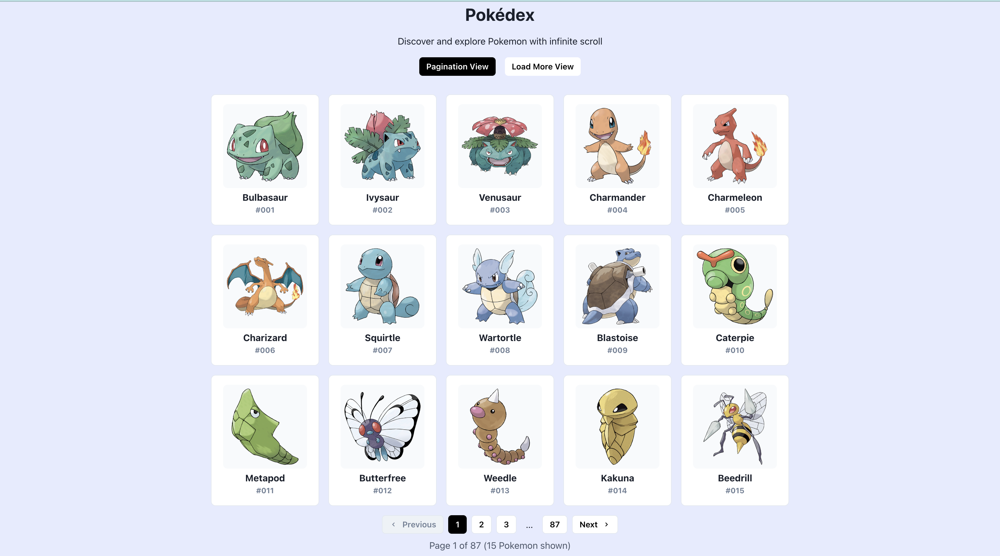

# 🧬 [Pokémon App](https://pokemonappbrowser.netlify.app/) — React + Vite + Chakra UI

A fully responsive, modern web app that allows users to browse Pokémon from the [PokéAPI](https://pokeapi.co), featuring both **pagination** and **infinite scroll** views, detailed Pokémon profiles, and clean, scalable architecture built for performance.

## 🚀 Features

- ⚛️ **React 18** with **TypeScript**
- ⚡ **Vite** for fast dev/build
- 🌈 **Chakra UI** for accessible and responsive design
- 📡 **React Query** for efficient API caching and state management
- 🔁 **Pagination** with page buttons and ellipsis navigation
- 🔄 **Infinite Scroll** with Intersection Observer and loading spinner
- 🧾 **Detailed Pokémon Pages** (name, sprite, height, weight, types)
- 🧪 **React Testing Library** & **Vitest** setup for unit testing
- 📱 Fully **responsive layout** across mobile, tablet, and desktop
- ✅ Strong **TypeScript typing** for API safety and maintainability

## 📸 Preview



## 📦 Tech Stack

- **Frontend**: React, TypeScript, Chakra UI, React Query, React Router
- **Tooling**: Vite, Yarn, ESLint, Prettier
- **Testing**: Vitest, React Testing Library
- **API**: [https://pokeapi.co](https://pokeapi.co)

## 🧩 Project Structure

```
src/
├── components/       # Reusable UI components like <PokemonCard />
├── pages/            # Pages: PaginationView, InfiniteScrollView, DetailPage
├── hooks/            # Custom hooks for API logic
├── services/         # API service calls (fetchPokemons, etc.)
├── types/            # Shared TypeScript types
└── App.tsx           # Main router & layout
```

## 📄 Getting Started

```bash
git clone https://github.com/yourusername/pokemon-app.git
cd pokemon-app
yarn
yarn dev
```

Open `http://localhost:3000` to get started.

## 🧪 Run Tests

```bash
yarn test
```
